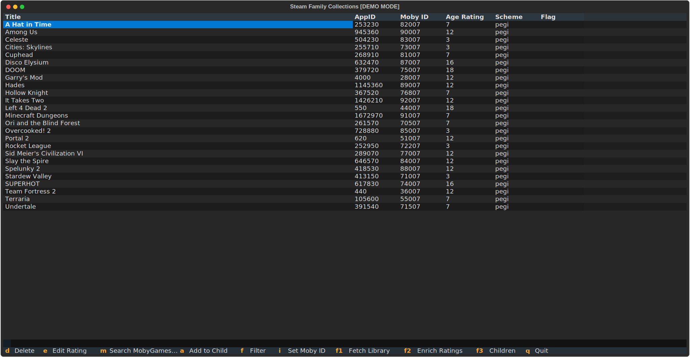

# Steam Family Collections

Steam Family Collections is a terminal UI app that helps parents create age-appropriate Steam game collections for their children, based on official PEGI, BBFC, ESRB, and other ratings.



## Features

- **Fetch your Steam library** — pulls all owned games via the Steam API in one keystroke
- **Automatic ratings** — looks up age ratings from the Steam store and MobyGames
- **Multiple rating schemes** — supports PEGI, BBFC, ESRB, USK, ClassInd with configurable preference order
- **Child profiles** — create profiles for each child with a maximum age rating
- **Push to Steam** — writes directly to Steam's cloud-storage so each child's Steam client shows only their approved games
- **Demo mode** — try the full app with bundled sample data, no API keys needed

## Quick start

```bash
# Clone and install
git clone https://github.com/dave-tucker/steam-family-collections
cd steam-family-collections
uv sync

# Try demo mode (no API keys required)
echo '[app]\ndemo = true' > config.toml
uv run python main.py
```

See [Installation](installation.md) for full setup with real Steam data.
