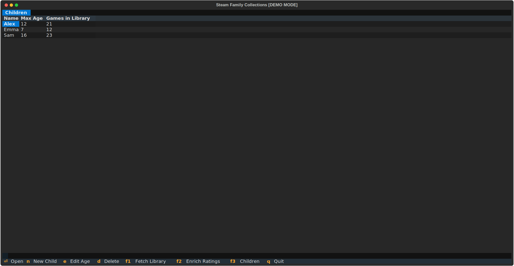
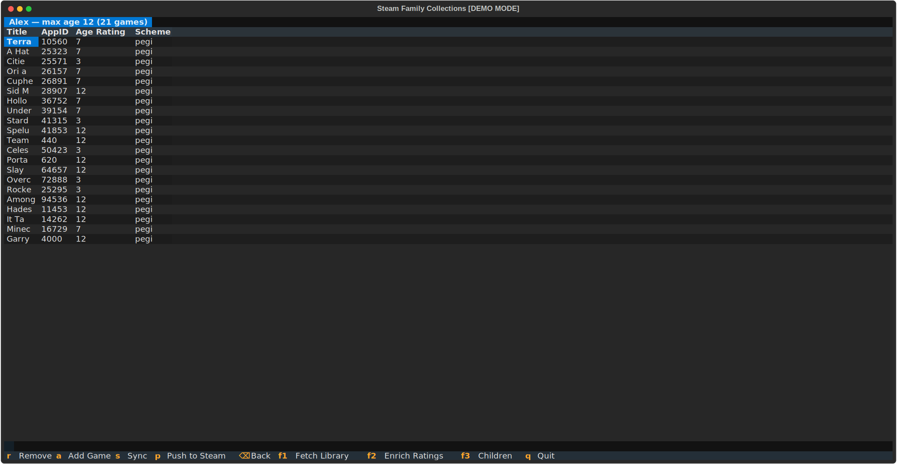

# Usage

The workflow has four steps: fetch your library, enrich ratings, set up child profiles, and push to Steam.

## Keyboard shortcuts

| Key | Action |
|-----|--------|
| `F1` | Fetch Steam library |
| `F2` | Enrich ratings (Steam store + MobyGames) |
| `F3` | Toggle Children screen |
| `Q` | Quit |

### Library screen

| Key | Action |
|-----|--------|
| `D` | Delete selected game and its rating |
| `E` | Edit age rating manually |
| `M` | Search MobyGames with a custom term |
| `I` | Set MobyGames ID manually |
| `A` | Add selected game to a child's collection |
| `F` | Cycle filter: all → unrated → ambiguous |

### Children screen

| Key | Action |
|-----|--------|
| `N` | New child profile |
| `E` | Edit max age |
| `D` | Delete profile |
| `Enter` | Open child's collection |

### Collection screen

| Key | Action |
|-----|--------|
| `A` | Add an eligible game |
| `R` | Remove selected game |
| `S` | Sync (recompute from current ratings) |
| `P` | Push collection to Steam |
| `Backspace` | Back to Children screen |

---

## Step 1 — Fetch library

Press `F1` to pull your owned games from the Steam API. New games are added to `~/.local/share/steam-family-collections/games.json`. Games already in the database are not overwritten.

---

## Step 2 — Enrich ratings

Press `F2` to look up age ratings. The app runs two passes:

1. **Steam store pass** — scrapes the Steam store page for each unrated game (1 second per game to respect rate limits)
2. **MobyGames pass** — searches MobyGames for games still unrated after the Steam pass; you may be asked to disambiguate titles

When multiple candidates match a title, a disambiguation dialog appears. Select the correct entry or press `Escape` to skip.

Use `F` to filter the table to unrated or ambiguous games only, making it easier to focus on what needs attention.

**Tip:** If a game is hard to find automatically, press `M` to search with a custom term, or `I` to enter the MobyGames ID directly.

---

## Step 3 — Manage children

Press `F3` to open the Children screen.

Press `N` to create a new child profile. Enter a name and a maximum age rating (0–18). The library is populated immediately from already-rated games.

Press `E` on an existing profile to adjust the max age — the library is resynced automatically.

---

## Step 4 — Push to Steam

From the Children screen, press `Enter` on a child to open their collection.

Use `A` to add individual games, `R` to remove them, and `S` to resync the entire collection against current ratings.

When ready, press `P` to push the collection to Steam.

!!! warning "Close Steam first"
    Steam must be fully closed before pushing. The app writes to Steam's cloud-storage file on disk; if Steam is running it will overwrite your changes on next sync.

A backup of the existing collection file is created automatically before each push.

### Approving games in Steam

After pushing, you need to approve the games in Steam for your child:

1. Open Steam and go to **Library → Collections**. Select the collection you just pushed.
2. Click the first game in the collection sidebar on the left.
3. Scroll to the bottom of the collection in the sidebar, then **Shift+click** the last game to select all.
4. Right-click the selection and choose **Family → Approve for &lt;child&gt;**.

---

## Tips

- Run `F2` periodically as your library grows — new games start unrated.
- Use `F` (filter) to work through unrated games in batches.
- The `S` (sync) button on the collection screen is useful after a bulk ratings enrichment session.
- Child profiles are stored in `~/.local/share/steam-family-collections/children/` as plain JSON — easy to back up.
